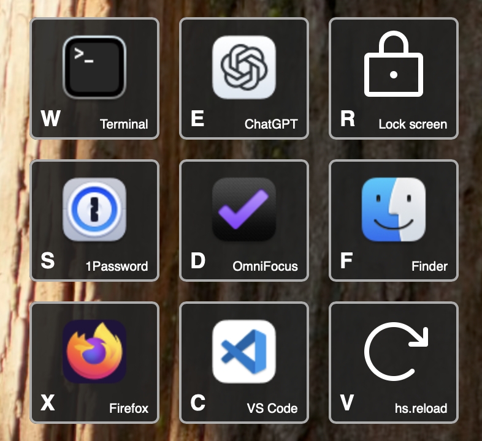

# GridCraft

An action menu based on StarCraft II Grid Hotkeys

See a video demo, example configurations, and full documentation at <https://pages.micahrl.com/GridCraft>.

It looks like this:

## Installing a release

1. Download `GridCraft.spoon.zip` from the [releases page](https://github.com/mrled/GridCraft/releases)
2. Extract the zipfile
3. Double-click `GridCraft.spoon` in the Finder

Then configure it in your Hammerspoon `init.lua`.
You could start with a [very simple configuration](https://pages.micahrl.com/GridCraft/docs/examples/simple-2x2/)
and expand from there,
or see [what other users are doing](https://pages.micahrl.com/GridCraft/docs/examples/in-the-wild/).

## Development

See [development.md](./development.md) for notes on working with the source code.

Issues and PRs are welcome!
