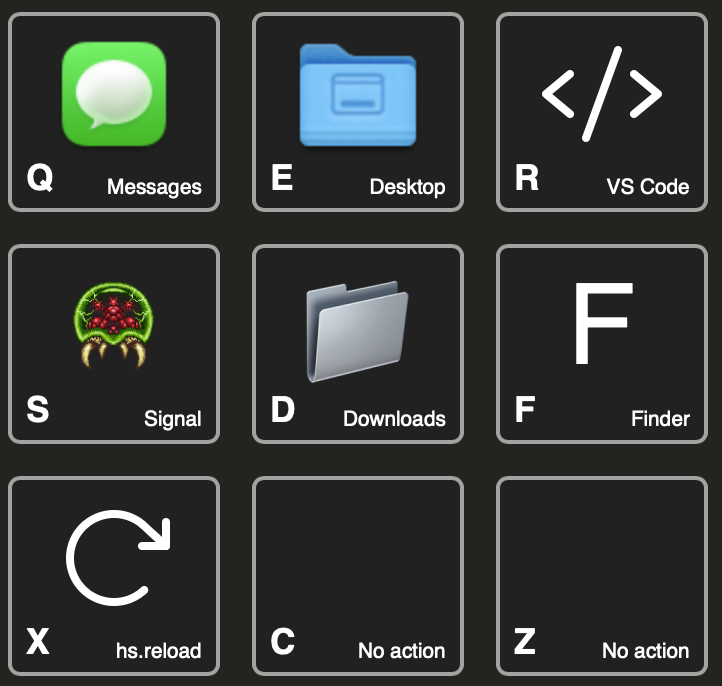

+++
title = "Simple Icons"
weight = 15
+++

A few examples of how you can set icons.

* Applications with `application = "App Name"` automatically are assigned the icon of the app
* Files (and folders) with `file = "/path/to"` automatically get the icon of the file or folder
* All Phosphor icons are built in and available
  with `icon = GridCraft.Icon.phosphor("name", "weight")`;
  search through available icons at <https://phosphoricons.com>
* An `<svg>` can be embedded directly as a string
* Any emoji or single letter can be embedded as a `X`
* An `` can also be embedded directly,
  either by pointing to a hotlinkable image (not recommended)
  or by encoding as base64 and including as a `data:` URI;
  use `GridCraft.Icon.fileContents` to get a `data:` URI from an image on disk


