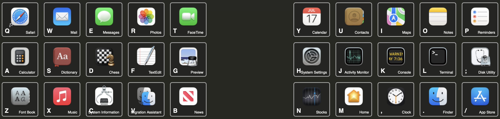

+++
title = "Split QWERTY"
weight = 30
+++

Here's an example of a much larger grid,
a full-QWERTY layout for a split keyboard like an
[ErgoDox](https://www.ergodox.io/),
[Voyager](https://www.zsa.io/voyager),
[Advantage360](https://kinesis-ergo.com/keyboards/advantage360/),
etc


